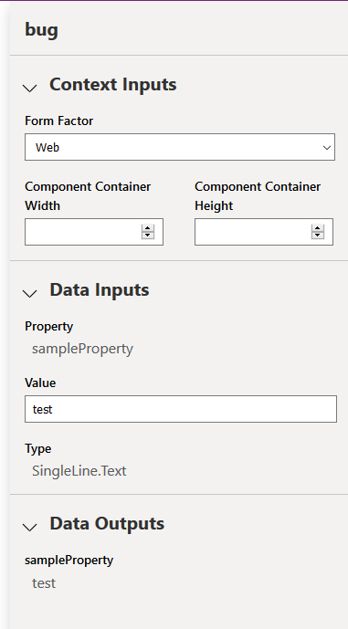
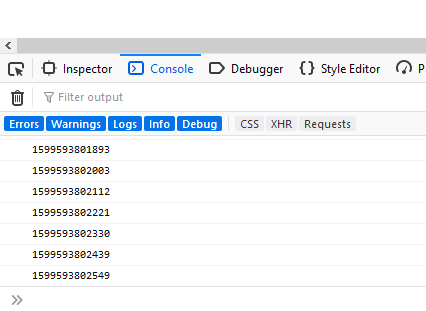

# pcf_test_hardness_endless_loop_bug

## Description

When an output property's value is set, the PCF test harness sees it as a change and triggers a call to updateView, even though the property is marked as "output", and its value hasn't changed.

This is a problem in two ways:

- The property's value hasn't changed (although it has been set ... to the same value)
- The property is marked as an output property, so changes its value shouldn't trigger an updateView

Additional issues:

- the property is shown both in the Data Inputs and Data Outputs section, which may be why the bug is occuring in the first place.



## Recreate the bug

Run this project using the PCF test harness

```npm run start```

Open the Developer tools window and view the console. You will see the time being outputed to the console.s

